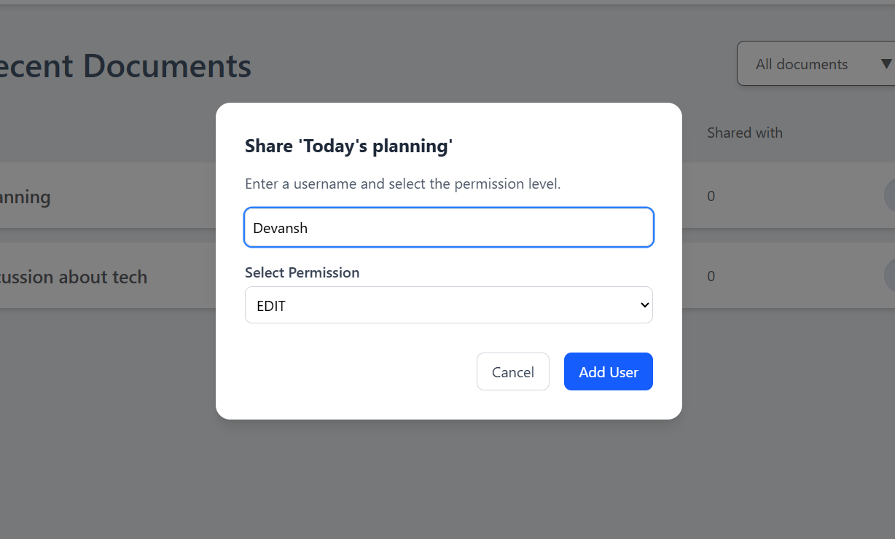

# CRDT-Based Collaborative Document Editor


**A Google Docs like real-time collaborative editor that handles concurrent edits seamlessly using CRDTs.**  
Built for reliability, scalability, and a smooth user experience, this project demonstrates:

- **Conflict-free real-time editing** for multiple users
- **Live cursors and rich-text formatting**
- **Eventual consistency without central locking**
- **Secure multi-user access** with JWT
- **Persistence in PostgreSQL** and scalable backend with Spring Boot + WebSockets

---

## 🚀 Key Achievements

- Implemented **operation-based CRDTs** for character-level conflict-free edits
- Enabled **real-time collaboration** with live cursors and formatting
- Designed a **scalable WebSocket backend** to handle concurrent edits efficiently
- Achieved **eventual consistency** without central locks or conflicts
- Integrated **JWT authentication** and PostgreSQL persistence for secure multi-user support
- Built a **modern, responsive UI** using React, Quill.js, and TailwindCSS
- Prepared system for **future scalability** with modular CRDT structure (RGA/Logoot)

---

## 🚀 Features

- Real-time collaboration – multiple users can edit the same document simultaneously
- CRDT-powered conflict resolution – concurrent inserts/deletes are merged deterministically
- Text formatting – supports bold, italic, and other rich-text styles
- Live cursors – track other collaborators in real time
- Authentication & Authorization – JWT-based secure access
- Persistence – CRDT state serialized and stored in PostgreSQL
- Scalable WebSocket backend – Spring Boot + STOMP over SockJS
- Modern UI – React, Quill.js, TailwindCSS

---

## 🏗️ Architecture

**Frontend (React + Quill.js)**

- Rich text editor with cursor tracking
- Maintains a local CRDT structure and broadcasts operations via WebSockets

**Backend (Spring Boot + WebSockets)**

- Handles CRDT operations (`insert`, `delete`, `format`) via STOMP endpoints
- Manages per-document CRDT state in memory with persistence to PostgreSQL
- Uses **deterministic ordering rules** (`counter@clientId`) to ensure convergence

**Database**

- PostgreSQL stores serialized CRDT state for persistence

---

## 📚 Research Basis

Based on the CRDT algorithms described in the paper:

> Shapiro et al., _“A Survey of CRDTs for Real-Time Collaborative Editing”_
> [Crdt Reasearch paper](./CRDT_Research_Paper.pdf)

Implemented concepts:

- **Operation-based CRDTs** for character-level editing
- **Unique IDs** (`counter@clientId`) and deterministic ordering for convergence
- Conflict-free handling of concurrent inserts/deletes

---

### 🖼️ Screenshots

- **Login and Sign up**
  
  

- **Dashboard**
  

- **Doc manage**
  
  
  
  

- **Doc edit view**
  
  

---

## ⚙️ Tech Stack

- **Frontend**: React, Quill.js, Quill-Cursors, TailwindCSS
- **Backend**: Spring Boot, STOMP over SockJS, WebSockets
- **Database**: PostgreSQL
- **Auth**: JWT

---

## 🛠️ Getting Started

### Prerequisites

- Node.js (v18+)
- Java 17+
- PostgreSQL

### 1. Clone the Repo

```bash
git clone https://github.com/Devansh-ds/Collaborative-text-editor
cd Collaborative-text-editor
```

### 2. Setup the Backend

1. **Configure PostgreSQL and create a database:**

```sql
CREATE DATABASE crdt_docs;
```

2. **Update `application.yml` with your Postgres credentials:**

```yaml
spring:
  datasource:
    url: jdbc:postgresql://localhost:5432/crdt_docs
    username: your_username
    password: your_password
  jpa:
    hibernate:
      ddl-auto: update
    show-sql: true
```

3. **Start the backend:**

```bash
./mvnw spring-boot:run
```

**Backend runs on:** [http://localhost:8080](http://localhost:8080)

### 3. Setup the Frontend

```bash
cd frontend
npm install
npm run dev
```

**Frontend runs on:** [http://localhost:5173](http://localhost:5173)

### 4. Access the Editor

1. Open the frontend URL in your browser
2. Sign in, create a document, and start collaborating in real time

---

### 🔮 Future Improvements

- Undo/redo support
- Richer formatting (underline, lists, headings, etc.)
- Support for images and tables

---

### 📝 License

This project is licensed under the MIT License.
